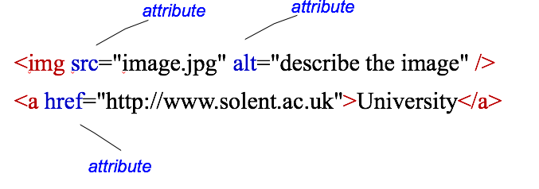
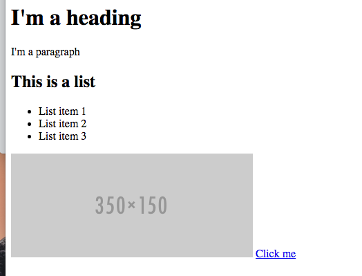
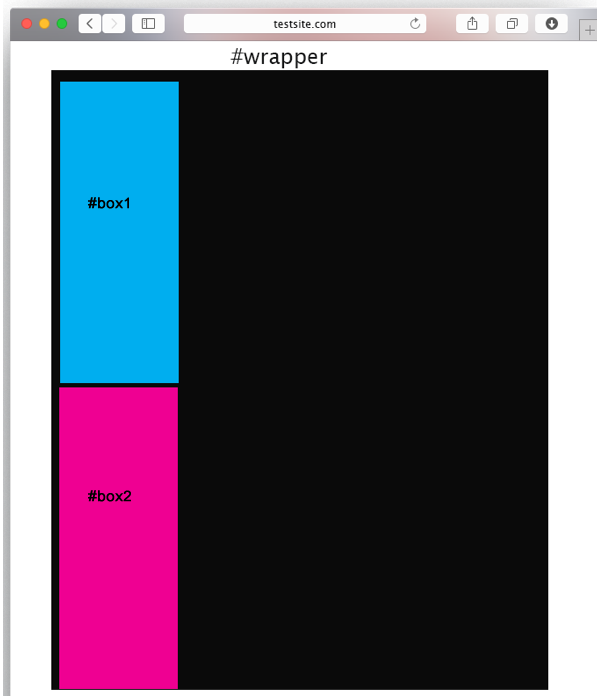

#Session 1  - HTML & CSS Review

The Web Design unit builds on your existing HTML/CSS skills. It extends the concepts learnt in internet technology. In order to make sure everyone is up to speed, in this session we will focus on revising some of the HTML/CSS essentials. 

##Structure of an HTML page

An HTML document is made up of elements
 
 - elements are containers for content
 - everything from the start tag to the end tag
 - some types of element may contain other elements

Each HTML page must be saved with a **.html** extension

```html 
<!DOCTYPE html>
<html>
      <head>
			<title>my first page</title>
      </head>
      <body>
			<h1>This is my first Web Page</h1>
			<p>I should write a paragraph about myself</p>
			
			<a href="http://www.solent.ac.uk">University</a>
      </body>
</html>

```

###Attributes 

 - Each element may have one or more attributes
	- provide additional information about elements
   - specified in the start tag



##Common Page Elements 

```html
...
<!-- I am a comment --> 
<div id="wrapper"> 
	<h1> I'm a heading </h1>  <!-- there should be only one h1 -->
	<p>I'm  a paragraph</p>
	<h2> This is a list </h2>
	<ul>  <!-- this is an unordered list -->
		<li class="odd"> List item 1</li>
		<li class="even"> List item 2 </li>
		<li class="odd"> List item 3 </li>
	</ul> <!-- end list -->	
	
	<a href="/home.html"> Click me </a> 
</div> <!-- [END] #wrapper --> 

...
```



>> Above code rendered in browser (it's not very pretty yet!)


### class and id Attributes

In the above example notice the use of class and id attributes, e.g

```html 
	<li class="even"> List item 2 </li>
	<div id="wrapper"> 
```

- **class** specifies the element as a member of one or more classes 
allow developers to define specific kinds of a given element
syntax:   `<element class="classname">`


- **id** specifies a unique id for an HTML element
can be used to point in a style sheet
syntax: <element id="id">
##CSS 

- CSS stands for Cascading Style Sheets 

- Styles define how to display HTML elements


##Including an external style sheet 

```html
<head>
<link rel="stylesheet" type="text/css"  href="mystyle.css"/>
</head>
```

##Styling HTML page elements 


###Directly styling an element 

Within our style sheet we can target specific html elements, e.g.:

```html 
 	h1 { color : blue; font-size: 200% } 
```

- This will make all `<h1>` headings blue, and double normal font size (200%)

####Common attributes 
|font size| Font size |
|---------| ----------|
|font-family| Font family (helvetica, arial etc)|
|font-weight | Font weight (degree of boldness) |
| color | Text colour |
| background-color | 	Background colour|


###Styling tags with classes or id's 

**HTML**

```html
<p id="para1">First paragraph, blah blah blah...</p>
```

**CSS**

```css
#para1 { background-color: yellow }
```


**HTML**

```html
<p class="para1">First paragraph, blah blah blah...</p>
```


**CSS**

```css
.para1 { background-color: yellow }
```


###CSS positioning 

The best way to position HTML elements is by using the CSS `float`
property:

**Default static position of 2 DIVS**

```html
#wrapper{
width: 80%
}
#box1 {
     width: 20%;
}
#box2 {   
   width: 20%;   
}
```




**Adding a float to the left**

```html
#wrapper{
width: 80%
}
#box1 {
   width: 20%;
  float: left;
  
}
#box2 {   
   width: 20%; 
   float: left; 
   
     
}

/* We could add margin-left:20%; to #box one to create space 	*/

```


**Adding a float to the left and right**

```html
#wrapper{
width: 80%
}
#box1 {
     width: 20%;
  float: left;
}
#box2 {   
   width: 20%; 
   float: right;   
}

```


##Task

[Create an HTML page](task.md)


