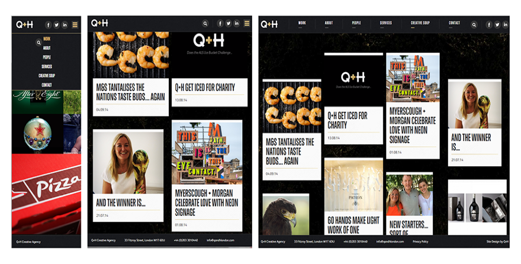
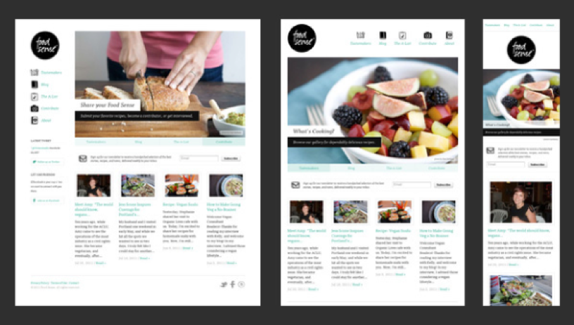
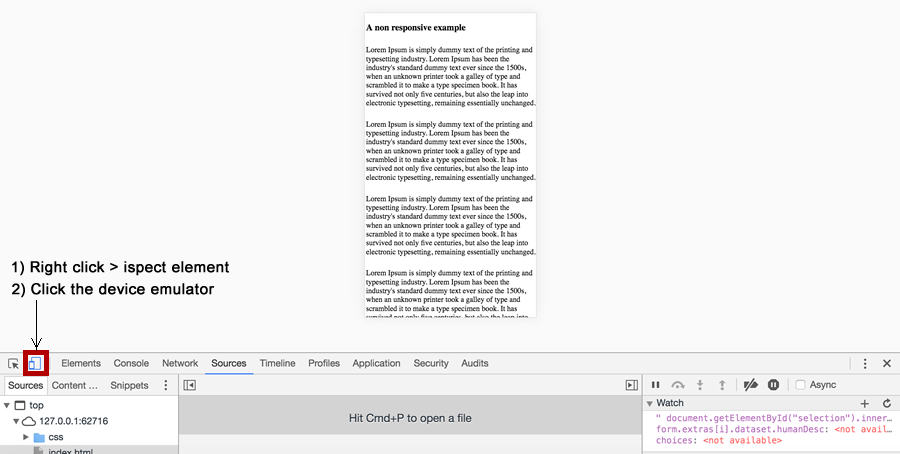
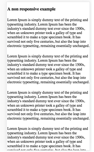
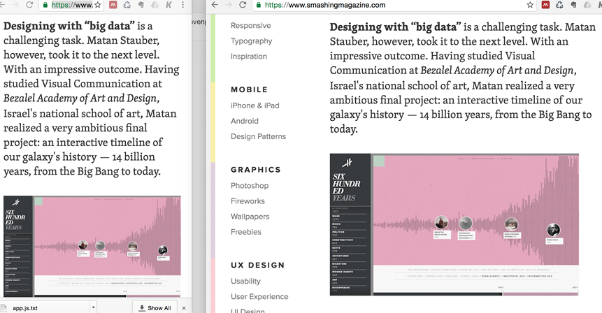

#Example of Responsive Design
For this unit, you'll need to create a brand and represent that brand in a responsive website. 

 Responsive design web design is an approach that allows the 
 website to naturally adapt based on the device you are viewing it on.  <small>[http://alistapart.com/article/responsive-web-design](http://alistapart.com/article/responsive-web-design)</small>
 
 >> Rather than tailoring disconnected designs to each of an ever-increasing number of web devices, we can treat them as facets of the same experience. We can design for an optimal viewing experience, but embed standards-based technologies into our designs to make them not only more flexible, but more adaptive to the media that renders them. In short, we need to practice responsive web design.   
 
 **- Ethan Marcotte, A List Apart** 
 
 

##Some examples of responsive design 

>> [http://designmuseum.org/](http://designmuseum.org)  
>> [http://foodsense.is/](http://designmuseum.org) 
>> [http://qandhlondon.com/](http://qandhlondon.com/)  
>> [http://www.wwf.org.uk/](http://www.wwf.org.uk/)  
>> [http://www.vouchercodes.co.uk/](http://www.wwf.org.uk/) 

##Why Responsive Design is So Important 

- The number of smartphone users worldwide is set to be more than 2 billion in 2016 ([emarketer](http://www.emarketer.com/Article/2-Billion-Consumers-Worldwide-Smartphones-by-2016/1011694))
- More searches are now on mobile devices than desktops ([google](https://adwords.googleblog.com/2015/05/building-for-next-moment.html))

##A quick way to emulate different devices 

In order to test responsive websites we need to view the site trough a variety of different devices. Although using actual different physical device is a legitimate test strategy, taking  such an approach in our day to day development workflow is not feasible. 

Chrome developer tools offers a handy bit of functionality that allows us to simulate different devices. 

- Simply right click on the website you want to test and select **inspect element**	
- Click the device emulator
- Elect which device you want to emulate from the drop down that will appear at the top of the screen

##The Viewport
**One of the most important concepts in responsive design**

- Viewport is **the display** through which we **view a website**
- You may recall form internet tech we would assumed that we were building our sites for a display with a width of 980px. Historically this was the typical minimum monitor/viewport size. 

###Viewport is simple when it comes to desktop browsers

The viewport is the same size of the browser. When we make the browser small the viewport becomes smaller. 

###When it comes to mobile devices things are't quite as simple

>> The same site as above on a mobile, we can still see all the content but it's very small!

Typically on a mobile the viewport is set larger than the device, then entire view is scaled down to fit the device. This ensures the entire page is shown, the problem with this is the content will become very small.

###Breakpoints 

>> Notice on the smaller view of smashingmagazine.com on the left a breakpoint is triggered and the menu is removed

* Along with the viewport, breakpoint are also a fundamental of responsive design. 

* A breakpoint is the point at which a website changes layout based on the width of the viewport. 

* Common breakpoints:
 - Extra small devices, for example, Phones (<768px)
 - Small devices, for example, tablets (3768px and <992px)
 -  Medium devices, for example, desktop computers (3992px and <1200px)

### Further Resources

- CALLAHAN, B., 2012. Responsive design. Freiburg, Germany : Smashing Magazine	

- MARCOTTE, E., 2015. Responsive design : patterns and principles. New York : A Book Apart

- [A great youtube tutorial](https://www.youtube.com/watch?v=BIz02qY5BRA)

##Weekly Task

[Task](Practical - Responsive web design experimentation )

