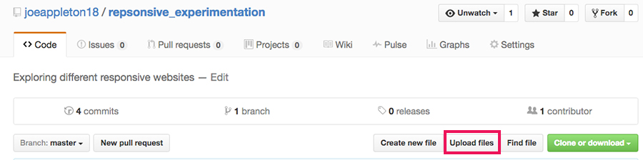
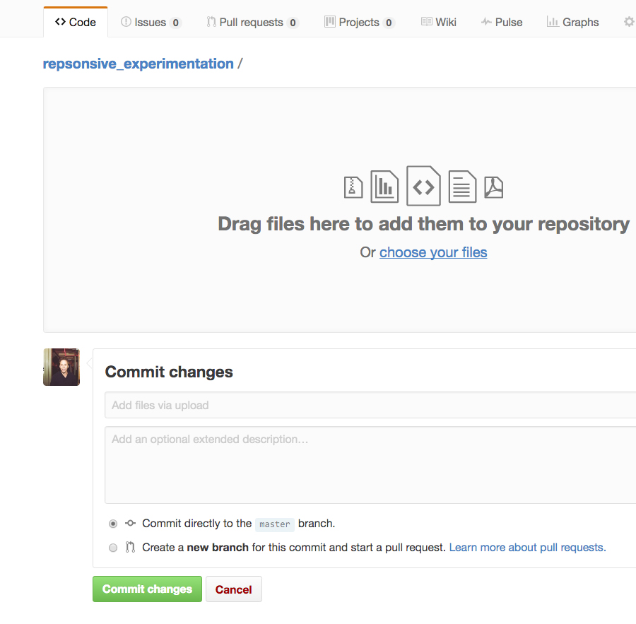
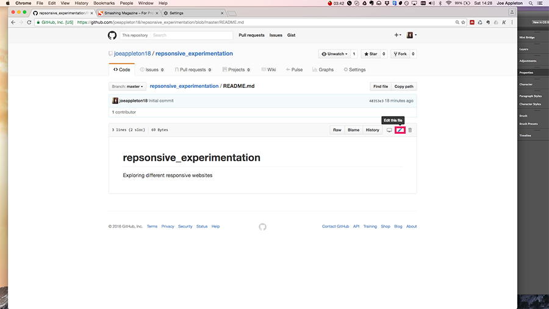

#Session 2 Practical - Responsive web design experimentation 

This week's practical is about exploring responsive websites, using the developer tools device emulator. We're also going to use this as an opportunity to introduce markdown and Github. **Markdown** is a way to style easily and quickly style documents on the web.

**Important: this work can be used as part of your assessment 1 experimentation**

##1) Create a github account 

If you don't have a github account already visit [www.github.com](http://www.github.com) and create a new profile

##2) Search the web for some responsive websites  
  

>> This is the type of comparative image we're looking for

- Find at least 3 examples of responsive websites and using the google chrome web emulator take screenshots of the desktop and web version of the sites 

- Create comparison before and after images using a image editor of you choice (i used photoshop). Once you've created the comparison images export them as an appropriate web format (e.g. jpg, png)

##3) Upload the comparison images to github

 - On github.com, locate the repository you created in step 1. 
 - Then click on upload files, you should upload all of your comparison images created in step 2 
 
 	
 	
- After you've uploaded your images, you'll need to click commit changes. We'll look at commits in more detail later in the course. In essence it a way to track changes to a given repository/project 	
 	
 	

##4) Edit your readme.md on gitHub.com

 - In the main part of your repository file listings, click on readme.md
 - Next, click on edit to bring up the source code for this file:
 
]

- Using markdown, construct a document listing the websites that you compared. You should include your images and using bullet points document observation of what happens when certain break points are hit.	
- In order to do this you'll need to research markdown, use this reference [here](https://gitbookio.gitbooks.io/markdown/content/)

- Look at my sample document to get a further idea on how to implement markdown:

	- [Source](https://github.com/joeappleton18/repsonsive_experimentation/blob/master/README.md)

	- [Output](https://github.com/joeappleton18/repsonsive_experimentation/blob/master/README.md)

