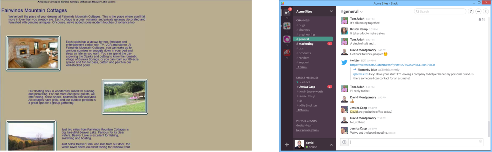

# The need for a better version of CSS




>> The evolution from websites to web applications

- CSS is nearly 30 years old! In this time websites have evolved from simple documents to complex multi faceted applications that can run on any device. 


## CSS Preprocessors


>> SASS and less are the two most popular CSS preprocessors

- Due to the complexity of modern day web application there have been a number of tools that allow us to extend the simple capabilities of CSS.   Such tools are know as **CSS Preprocessors**, two of the most popular are **LESS and SASS**

- Put simply, CSS Preprocessors covert a more usable version of CSS into native everyday **CSS**

- While SASS and less are both powerful extensions to CSS, SASS is used on a much wider scale. It has a number of advantages over LESS, with perhaps the main one being that a CSS file is also a valid SASS file


# Getting Started With SASS

## Installation

- SASS is generally used as a command line tool and is simple to install, check the [official installation instructions](http://sass-lang.com/install)

- If however you're using cloud9 it comes installed as standard. Simply open up a terminal window and enter  `sass -version`  you should see something like `Sass 3.4.23 (Selective Steve)`
	
## Structuring your project	

- Once installed we need to set up our websites directory structure so it facilitates the use of SASS. We have freedom in how we do this, but remember, for your assignment you will need to reference a style guide or come up with your own. I recommend using [https://sass-guidelin.es/#architecture]()

- Using [https://sass-guidelin.es/#architecture]() as inspiration, below is an example of how we would structure a typical project. Much of it won't make sense at this stage, however it will become clear as we explore sass


```

index.html 
css/
|	|- main.css
sass/
|– main.scss              # Main Sass file
|– abstracts/
|   |– _variables.scss    # Sass Variables
|   |– _functions.scss    # Sass Functions
|   |– _mixins.scss       # Sass Mixins
|
|
|– base/
|   |– _reset.scss        # Reset/normalize
|   |– _typography.scss   # Typography rules
|   …                     # Etc.
|
|– components/
|   |– _buttons.scss      # Buttons
|
|
|– layout/
|   |– _navigation.scss   # Navigation
|   |– _grid.scss         # Grid system
|   |– _header.scss       # Header
|   |– _footer.scss       # Footer
|   |– _sidebar.scss      # Sidebar
|   |– _forms.scss        # Forms
|   …                     
|
|– pages/
|   |– _home.scss         # Home specific styles
|                         # Contact specific styles
|                         # Etc.
|
|
```
>> A sample project SASS structure, note that in the sub directories the files are examples. Also, the structure is a free choice, you may try and simplify the above. 

- Notice in the above example how every file has a `scss` extension. Furthermore, apart from main.scss is preceded by a underscore `_`. `_` denotes a partial SASS file, it's intended to be imported by another file, in this case it will be main

### Pro Tip 

- Within your project directory use the following terminal command to set up your entire structure:

```
mkdir css  sass  sass/abstract sass/base sass/components sass/layout sass/pages    
```                                                                                                            

## Compiling SASS  

- As mentioned, SASS is a extension of CSS. However, browsers won't recognise it so it therefore needs to be compiled into CSS using the SASS command line app 

- The idea of compiling CSS may at first seem like an unnecessary complication. However, just trust me in that using SASS is going to improve your workflow and organisation so much, it's worth the effort

- To compile SASS on a continuous watch, point your terminal window at your project root and run the following command:

```
  sass --watch scss/main.scss:css/main.css
```
>> Where `scss/main.scss` the path to our main.scss file and `css/main.css`. The `--watch` flag ensures instructs SASS to continually run in the background
 

## Using SASS

Every HTML file in your project should include the `main.css` file:

`<link rel="stylesheet" href="css/main.css" type="text/css"/>`

This will be the only CSS file you need to include, ever again! **NOTE** you should never edit it.


### Imports 

- Using the above SASS style guide,  main.sccs acts as the glue for all of our partials file. We can use SASS imports to pull these files in  	

- For example if [I copy a common normalise css the contents file](https://necolas.github.io/normalize.css/7.0.0/normalize.css) and place it in `/base/normalise.scss`

- I can then simply import this file into `main.scss`

`@import 'base/normalise'`

>> Notice how we can omit the file extension

- If all has worked correctly the contents of `normalise.scss` should have been pulled into `main.css`


### Variables

- SASS allows us to use variables. Much like in programming they allow us to store common values. Given our above structure global level variables should be stored in:

```
– abstracts/
  |– _variables.scss

```

 - In `main.scss` we would need to import our variables file
 
 - The **$** sign used to a variable 
 - Let's say we want to use the below colour pallet for our website
 
 
>> using a tool like [https://coolors.co/]() gives me names along with HEX values for my chosen colour pallet 

- These name value parings can be represented in sass

```
$iguana_green: #79B473;
$shiny_shamrock: #70A37F;
```
- We can now use these variables anywhere in any other SASS file

```
p {
 font-size: 12px;
 color: $iguana_green;
}
```
**This would compile to**

```
$pink: #ea4c89;
p {
 font-size: 12px;
 color: #79B473;

}

```

**We can store any value we like in variables**

```
$font: arial, Helvetica, sans-serif;
```


```
body {
	font: $font-family;	
	
}
```


### Nesting 

- SASS let you nest CSS in a hierarchy, this allows the creation easily identifiable reusable components

```
header{

   logo.img {
      Float: left;
   }

	nav {
	  ul {
	    margin: 0;
	    padding: 0;
	    list-style: none;
	  }
	
	  li { display: inline-block; }
	
	  a {
	    display: block;
	    padding: 6px 12px;
	    text-decoration: none;
	  }
   }
}

```


### Pseudo Classes 

#### We can also nest pseudo classes, like this:

```
a {		color:$light_green; 
		font-weight:bold; 
		text-decoration:none;
 		&:hover{color:#505050; text-decoration:underline;}
  }

```

#### Extending  

- Using `@extends` allows you to easily share css properties from other selectors


```
.message {
  border: 1px solid #ccc;
  padding: 10px;
  color: #333;
}

.success {
  @extend .message;
  border-color: green;
}

```

# Practical 

[Practical](task.md) 


## Resources 

[Official SASS Guide](http://sass-lang.com/guide)

[Team tree house, SASS for beginners](http://blog.teamtreehouse.com/the-absolute-beginners-guide-to-sass)

[SASS Guidelines style guide](https://sass-guidelin.es/#variables)

[CSS Truckm SASS style guide](https://css-tricks.com/sass-style-guide/)


