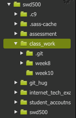

# JavaScript - Number guessing game


>> Important, all of your class work should now be under version control. At the end of each session you should be pushing your work up to gitHub. If you're confused about this please ask us and we an help you. 

**When I display hidden files, this is what my folder structure looks like**



The presence of the `.git` folder , means that all of the sub folders and files in  `class_work` are under version control.


# Set Up 

1) Within your `class_work` file, create a new folder and call it `week10`.

2) Within `week10` create the following files:

	- js/main.js 
	- index.html
3) Within `main.js` create a function called `main`, for now it will just have one line of code in it `alert('working')`

4) Within `index.html`s body tag, add a [inline load event](#running-javaScript) that calls the function `main`

# Task 

The aim of the task this week is to create a number guessing game. Your program will generate a number between a user defined range. The user will then make guesses with the aim of finding that number. Feedback will be given on if the guess is:

- Smaller than the number
- Larger than the number 
- An exact match! 

1) Add the following elements to `index.html` and give them `id`'s where appropriate:


- An input and label for the guess 
- A `<button>Click Me </button>` that will be pressed after the guess 
- A paragraph to hold the result 


2) At the top of your javascript file create vars to hold the following values: 
	
	- random_number 
	
3) Inclue the below function into your js file 	

```html
function getRandomArbitrary(min, max) {
    return Math.round(Math.random() * (max - min) + min);
}
``` 

4) Set `random_number` equal to a random number by using the above function. This should be done in `main()` which is called when the page has loaded
 
5) Using the `document.query` selector add a [click event](notes.md#accessing-the-dom), to the button that runs a guess function. 

6) Write the guess function, it should grab the the [user input](notes.md#accessing-the-dom) and run some [comparisons](notes.md/#conditional-statements) and adjust the `inner_html` value of your paragraph to display the information based on the guess. 

7) **Advanced** set up a variable called `var number_of_guesses = 10`, decrement this variable on each guess. If the user runs out of guesses it's game over. The inputs should then be hidden. 